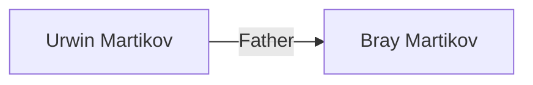

```dataviewjs

const targetYear = 2022 // For which year do you want to generate a chart?

// Below is the Dataview query. You might need to change the "FROM" field depending on your vault structure
const prompt = `LIST WITHOUT ID 
file.name + " :" + 
started.day + "-" + started.month + "-" + started.year +
", " + 
read.day + "-" + read.month + "-" + read.year
FROM #book
WHERE date(read).year = ${targetYear}
SORT read desc `

console.log(prompt)

// This is the Mermaid configuration.
const mermaidConf = `mermaid
gantt
    title Book Reading Chart
    dateFormat  D-M-YYYY
    axisFormat  %B
    todaymarker off`

console.log(mermaidConf)

const te = await dv.queryMarkdown(prompt)
const prefixedList = te.value
const list = prefixedList.replaceAll(/^-\s/gm, "") // Dataview prefixes each list item with a hyphen. That would break Mermaid's render, so we remove it.
const backticks = "```"

dv.paragraph(
  `${backticks}${mermaidConf}
${list}
${backticks} 
`,
)

```
```dataview
LIST WITHOUT ID 
file.name + " :" + 
started.day + "-" + started.month + "-" + started.year +
", " + 
read.day + "-" + read.month + "-" + read.year
FROM #book
WHERE date(read).year = 2022
SORT read desc 
```

